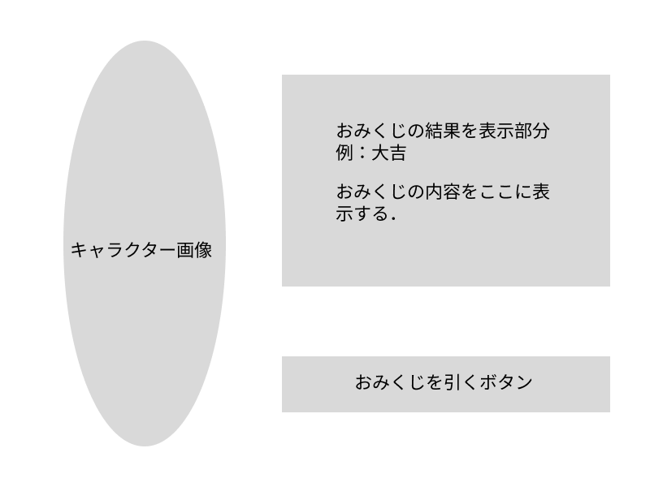
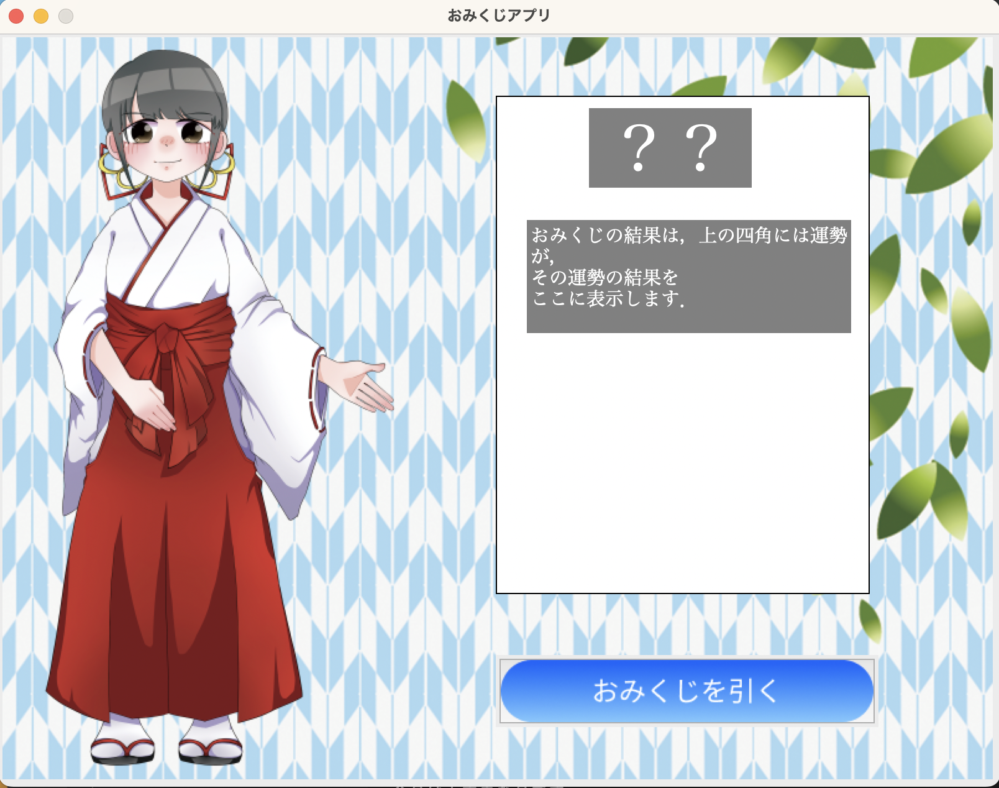
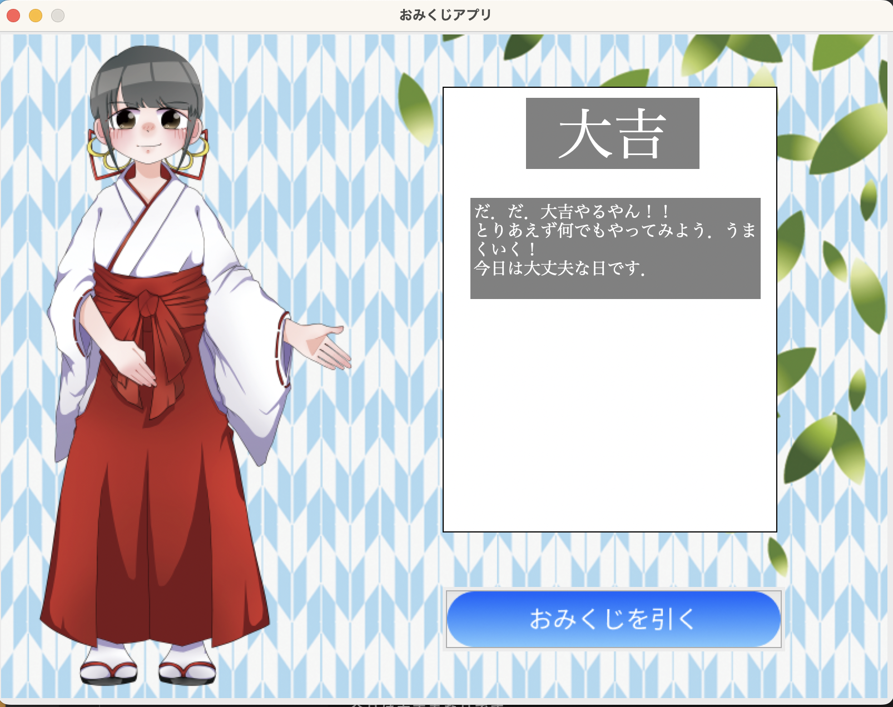

# おみくじアプリ作成

## 概要

ソフトウェアを開発する際は，ラフスケッチでよいので，最初に画面のレイアウトを考えておくと開発がスムーズに進む．
おみくじアプリは下記のような構成になる．

## 完成形

### 機能

- おみくじを引くボタンで，ランダムでおみくじの結果が表示されます．
- おみくじは結果ごとに確率が異なり，ランダムで結果が表示されて，表示テキストも結果ごとに変わります．

### 工夫した点

- 本に書かれていたおみくじアプリでは，おみくじの結果は，同じ確率で抽選して表示される仕組みでしたが，結果ごとに確率があった方が面白いと思ったので，クラスを定義して，クラス変数でインスタンス生成時に，引数として確率割合を渡し，それを合計した値で抽選することで滅多に出ないものなどを作成しました．
- また，おみくじの吉などの表示しかなかったのを，おみくじの内容も表示できるように変更しました．また，その時に長方形内に収めるために，17 文字で文字列を改行する，または 17 文字入っていない時は空白を入れて 17 文字に調整するようにしました．

 
※短いスパンでいろんなゲーム制作をして勉強をしているので，本の内容を改良しながら作成しています．そのためまだ雑なところが多いと思います．

### これからの追加したいこと

- 巫女の画像を結果ごとに用意して変更する．そのためには，バックグラウンド画像と，その上に載せる巫女画像のように変更する必要があると思う．
- 結果を表示部分をきれいにする
- おみくじをした人の名前を入力して，それを保存して，管理する．同じ名前の場合は，今までの結果の 3 回前までをどこかに表示するなどをできるようにする．
