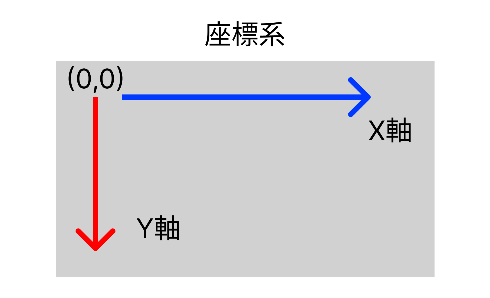

# Python で作る簡単なゲーム ゲーム制作の道(2)

#### 開始日

2023 年 09 月 13 日(水)

## 実行環境

- Python 3.11.3
- tkinter
- PyGame

## 作成ゲームについて

GUI で遊べるゲームを作成します．
GUI(Graphical User Interface)とは，グラフィックを使用し，マウスのようなポインティングデバイスによって操作する方式のこと．

### 座標系について

### 参考

- 初めの一歩を踏み出そう Python でつくるゲーム開発入門講座，著:廣瀬豪
